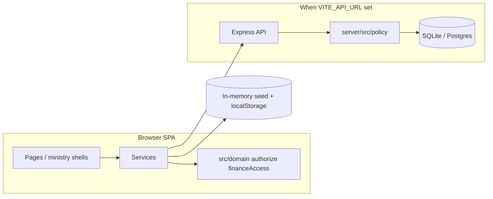

# Architecture overview

High-level map for reviewers and takeover teams. Details live in code comments and domain modules.

## System kinds

| Kind | Example IDs | Role |
|------|-------------|------|
| **MAIN** | `sys-main` | People, organisation, mission hub, peer launcher |
| **PEER** | `sys-choir`, `sys-youth`, … | Full ministry apps (SSO or direct login) |
| **SHARED** | `sys-finance` | Church ledger + org-private vaults |

Catalog: `src/data/seed.ts` (`SYSTEMS`), peer kit: `src/ministry/peerCoreSystems.ts`.

## Request flow (simplified)

## Non-negotiable rules (product)

- **Finance:** Ministry UX lives inside each ministry; vault access uses grants (`FundAccessGrant`), not implicit pastor access.
- **Choir:** One system, seven choir units; ENTER alone does not unlock every choir.
- **Members:** Limited module allow-list; treasury modules for board/treasurer roles (choir uses its own office matrix).

## Key paths

| Topic | SPA | Server |
|-------|-----|--------|
| Authorization | `src/domain/authorize.ts` | `server/src/policy/` |
| Finance ACL | `src/domain/financeAccess.ts` | Policy + `/api/funds` |
| SSO handoff | `src/domain/sso.ts` | `/api/sso/issue`, `/api/sso/redeem` |
| Mission | `src/services/missionService.ts` | `/api/mission/*` |

## Databases

- **Local:** `server/prisma/schema.prisma` → SQLite `dev.db`
- **Production:** `server/prisma/schema.postgres.prisma` → Neon (see [DEPLOY.md](../DEPLOY.md))

## Quality gates

- SPA: `npm run lint`, `npm run test`, `npm run build`
- API policy smoke: `npm run test:policy --prefix server`
- Combined: `npm run check` (also runs in GitHub Actions on `main` PRs)
